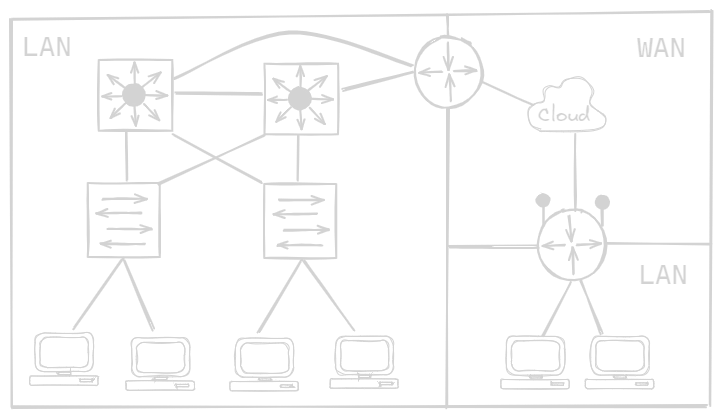
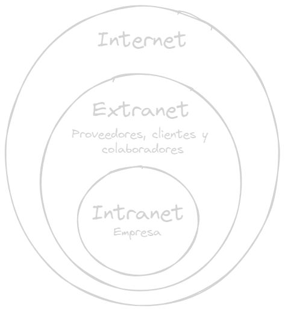

# :rat: Componentes de una red
:link: [Indice](README.MD)
## :cactus: HOST
Todas las computadoras conecadas a una red son categorizadas como host, algunos host son llamados clientes.
<table><td>El termino host se refiere a los dispositivos de una red que tienen asignados un numero (IP)</td></table>

Los **Servidores** son computadores que proporcionan informacion, cada servicio requiere un software de servidor independiente

  

### Tres tipos de software de servidor mas comunes
- Correo electronico
- Web
- Archivo
## :cactus: PEER TO PEER (P2P) 
Es posible usar una computadora con ambos roles de  cliente y servidor.

### Ventajas
- Facil de configurar
- Menos complejas
- Menos costo, es posile que no necesite dispositivos de red ni servidor dedicado
- Para tareas sencillas

### Desventajas
- Administracion NO centralizada
- No seguras
- No escalables
- Todos los dispositivos como cliente y servidor, lo que lentifica el rendimiento.

## :cactus: DISPOSITIVOS FINALES
Cada dispositivo final tiene una direccion, un terminal es el origen o destino de un mensaje

## :cactus: DISPOSITIVOS INTERMEDIOS
Conecta los dispositivos individuales a la red, pueden conectar multiples redes individuales. Proporciona conectividad y garantiza el flujo.

Usan la direccion de los dispositivos finales junto con la infromacion de las interconexiones para determinar la ruta.

   

Pueden tener una o todas las siguientes funciones
- Regenerar y retransmitir senales de comunicacion
- Conservar informacion acerca de las rutas
- Notificar a otros dispositivos sobre errores y fallas de comunicacion
- Dirigir datos en rutas alternativas a haber fallas
- Clasificar y dirigir mensajes segun prioridad
- Permitir o denegar acceso a datos segun seguridad

## :cactus: MEDIOS DE RED
Canales por los cuales viaja el mensaje
- Hilos metalicos dentro de cables: Impulsos electricos
- Fibra de vidrio o plastico:  Pulsos de luz
- Transmision inalambrica: Modulaciones de frecuencia

## :cactus: TOPOLOGIAS
- Tarjeta de interfaz de red (NIC): Conecta fisicamente un dispositivo final a una red
- Puerto fisico: Un conector de un dispositivo donde se conecta los medios a un terminal u otro dispositivo
- Interfaz: Puertos especializados en un dispositivo que se conectan a redes individuales. Como los routesr conectan redes, los puestor en el router se denominan interfaces

> Los terminos puerto e interfaz se suelen usar indistintamente

Los diagramas proporcionan informacion visual de como esta conectada la red
### Topologia fisica
Muestran la ubicacion fisica  de los dispositivos de la red, asi como la instalacion de cables
### Topologia logica
Ilustra los dispositivos, los puertos y esquema de direccionamiento red. Se puede ver con que medios se conectan los dispositivos
## :cactus: REDES
### LAN
Redes administrada por una organizacion o persona
### WAN
Red que conecta redes LAN mas pequenas, generalmente a cargo de varios proveedores de servicios.

  

### Internet
Coleccion global de redes interconectadas, no pertenece a nadie, requiere la aplicacion de estandares y tecnologias uniformes
> Las redes LAN ocupan servicios WAN para interconectarse

## :cactus: INTRANETS E EXTRANETS
Similares al termino de internet. Intranet es una conexion privada LAN y WAN de una organizacion. La extranet proporciona un acceso seguro para entidades externas para acceder a datos de la empresa

  

## :cactus: CONEXIONES A INTERNET

## Redes domesticas
- Cable: Mismo conexion a tv por cable
- DSL: Linea telefonica, asimetrica. velocidad de descarga mayor que de subida
- Celular
- Satelite: Linea clara al satelite
- Telefonia por Dial-up: Baja velocidad
- Fibra Optica

## Redes empresariales
- Lineas arrendadas dedicadas: Circuitos reservados que se arriendan
- Metro Ethernet: Extiende la tecnologia de acceso LAN a WAN
- DSL empresarial: SDSL es la mas usada, permite velicidades de subida y bajada similares
- Satelite

## Redes convergentes
Tradicionalmente existen redes distintas para cada servicio telefonico, broadcast y redes, cada uno con sus estandares e infraestructura

Hoy en dia estas redes estan converigiendo a una sola con un solo estandar, en la cual se puede transmitir voz, video y datos, entre distintos dispositivos en la msima infraestructura

## :cactus: REDES CONFIABLES

**[TOP](#top)**