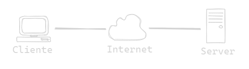
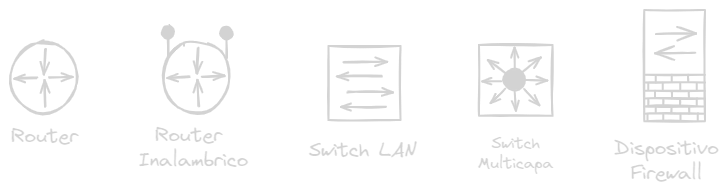

# :rat: Componentes de una red
## :cactus: Host
Todas las computadoras conecadas a una red son categorizadas como host, algunos host son llamados clientes.
>El termino host se refiere a los dispositivos de una red que tienen asignados un numero (IP).

Los **Servidores** son computadores que proporcionan informacion, cada servicio requiere un software de servidor independiente

  

### Tres tipos de software de servidor mas comunes
- Correo electronico
- Web
- Archivo
## :cactus: Peer to peer 
Es posible usar una computadora con ambos roles de  cliente y servidor.

### Ventajas
- Facil de configurar
- Menos complejas
- Menos costo, es posile que no necesite dispositivos de red ni servidor dedicado
- Para tareas sencillas

### Desventajas
- Administracion NO centralizada
- No seguras
- No escalables
- Todos los dispositivos como cliente y servidor, lo que lentifica el rendimiento.

## :cactus: Dispositivos Finales
Cada dispositivo final tiene una direccion, un terminal es el origen o destino de un mensaje

## :cactus: Dispositivos intermedios
Conecta los dispositivos individuales a la red, pueden conectar multiples redes individuales. Proporciona conectividad y garantiza el flujo.

Usan la direccion de los dispositivos finales junto con la infromacion de las interconexiones para determinar la ruta.

 

Pueden tener una o todas las siguientes funciones
- Regenerar y retransmitir senales de comunicacion
- Conservar informacion acerca de las rutas
- Notificar a otros dispositivos sobre errores y fallas de comunicacion
- Dirigir datos en rutas alternativas a haber fallas
- Clasificar y dirigir mensajes segun prioridad
- Permitir o denegar acceso a datos segun seguridad

## :cactus: Medios de red
Canales por los cuales viaja el mensaje
- Hilos metalicos dentro de cables: Impulsos electricos
- Fibra de vidrio o plastico:  Pulsos de luz
- Transmision inalambrica: Modulaciones de frecuencia