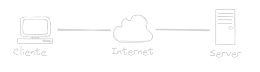

# :rat: Componentes de una red
---
## :cactus: Host
Todas las computadoras conecadas a una red son categorizadas como host, algunos host son llamados clientes.
>El termino host se refiere a los dispositivos de una red que tienen asignados un numero (IP).

Los **Servidores** son computadores que proporcionan informacion, cada servicio requiere un software de servidor independiente

  

### Tres tipos de software de servidor mas comunes
- Correo electronico
- Web
- Archivo
---
## :cactus: Peer to peer 
Es posible usar una computadora con ambos roles de  cliente y servidor.

### Ventajas
- Facil de configurar
- Menos complejas
- Menos costo, es posile qe nonecesite dispositivos de red ni servidor dedicado
- Para tareas sencillas

### Desventajas
- Administracion NO centralizada
- No seguras
- No escalables
- Todos los dispositivos como cliente y servidor, lo que lentifica el rendimiento.
---

## :cactus: Dispositivos Finales
Cada dispositivo final tiene una direccion, un terminal es el origen o destino de un mensaje

## :cactus: Dispositivos intermedios

